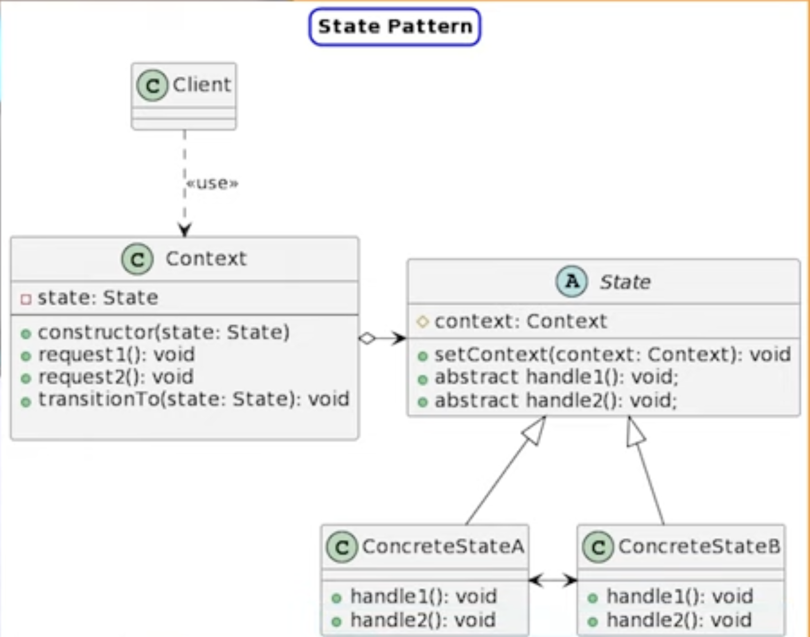
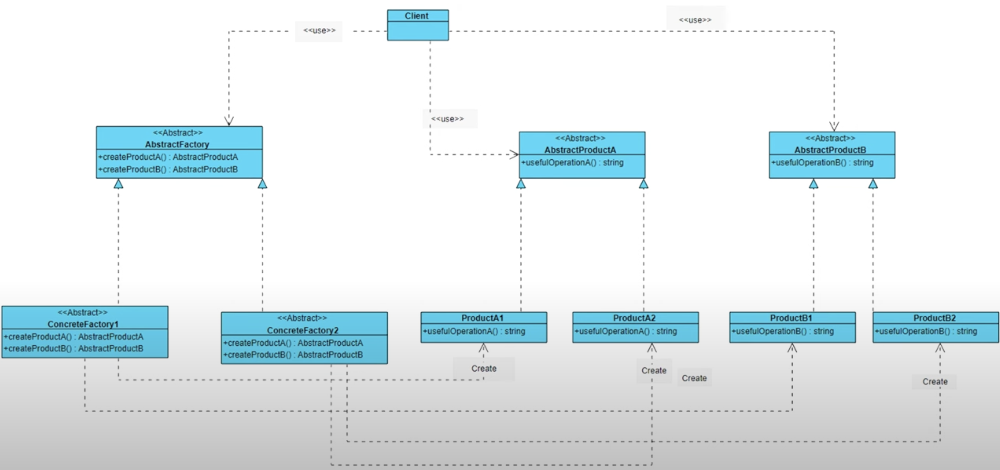

# Patrones de diseño By DotTech-ES 
- [Playlist](https://www.youtube.com/playlist?list=PLcrGLrk890EHggd_AtzoodFXnp-yXnzh4)

### Patron State
  
Permite que un objeto cambie su comportamineto cuando su estado interno cambia. 

El Objeto parecera que cambio de clase. 

Proncipalmente Respeta el principio de responsobilidad y Abierto cerrado. 

Se puede Agregar estados sin necesidad de Modificar el codigo existente. 

Cada estado se encarga de su propia logica y comportamiento 

### Patron Factory

- Metodo de Fabricacion estatico

### - Factory-method
  Nos proprciona un intefaz para la creacion de objetos el cual, sera implementado en la subclases que extiendden o implementa esta interfaz, Delegando la responsabilidad a la clase concreta 
  
### - Abstract Factory
Proporciona un interfaz para crear familias de objetos que estan relacionadas o son dependientes entres si. sin tener que especificar las las clases concretas.

### Patron Decorador

Añade responsabilidades adicionales a un objeto dinamicamente, Proporciona una alternativa flexible a la herencia para extender funcionabilidades. 

Mas facil de usar de comprender y testear 

Extender el comportamineto de un objeto sin necesidad de crear una nueva subclase 

Añade o elimina responsabilidades a un objeto 

Las resposabilidad puede ser combinada 

